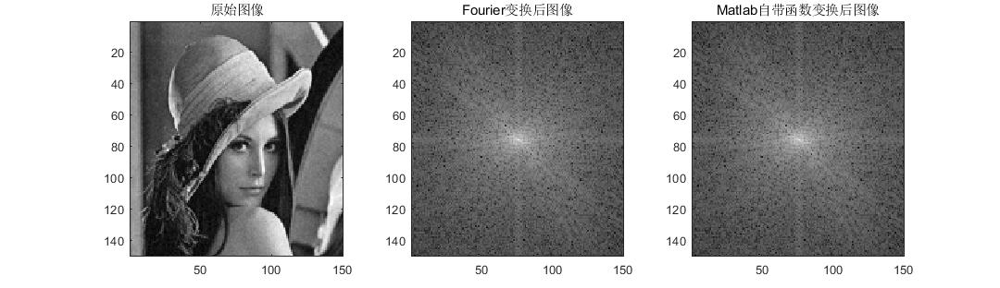

# 2D-Discrete-Fourier-Transform

https://github.com/kiyoxi2020/2D-Discrete-Fourier-Transform.git

## 二维Fourier变换

- 对于一个二维图像，二维Fourier变换本质上可以理解为在一组由Sine、Cosine函数构成的二维基底下，求取每个基底对应的相关值，这些相关值构成了这个二维图像在Fourier变换基下的表达

### 2D Continuous Fourier变换表达式：

$$F(u,v)=\int_{-\infty}^{\infty}\int_{-\infty}^{\infty}f(x,y)e^{-j2\pi(ux+vy)}dxdy$$

$$f(x,y)=\int_{-\infty}^{\infty}\int_{-\infty}^{\infty}F(u,v)e^{j2\pi(ux+vy)}dudv$$

其中，$u,v$表示频率取值，$e^{-j2\pi(ux+vy)}=\cos2\pi(ux+vy)-j\sin 2\pi(ux+vy)$，即基底是由Sine、Cosine函数构成的

### 2D Discrete Fourier Transform（2D DFT）的表达式：

$$F(u,v)=\sum_{x=0}^{M-1}\sum_{y=0}^{N-1}f(x,y)e^{-j2\pi(ux/M+vy/N)}$$

$$f(x,y)=\frac{1}{MN}\sum_{u=0}^{M-1}\sum_{v=0}^{N-1}F(u,v)e^{j2\pi(ux/M+vy/N)}$$

- 相当于，对于每一个频域中的点(u_0,v_0)，都对应时域中的一个基底：

  $b(x,y)=e^{-j2\pi(u_0x/M+v_0y/N)}=\cos2\pi(u_0x/M+v_0y/N)-j\sin2\pi(u_0x/M+v_0y/N)$

  其中，$x,y$为变量。比如，当取$(u_0,v_0)=(0,0)$时，$b(x,y)=1-j0$，即此时的基底就是一个取值恒定的图像。我们可以取不同的$(u_0,v_0)$，分别绘制其对应的基底图像：

  <u>**运行main_2ddft_plot_base.m**</u>

- 根据2D DFT的表达式，**Fourier变换的本质是去求空域图像$f(x,y)$与每个基底$(u_0,v_0)$之间的相关值**，将该相关值放在频域图像坐标$(u_0,v_0)$处，遍历每个可能的$(u_0,v_0)$即可得到最终的Fourier变换后的图像

  <u>**运行main_2ddft.m**</u>

  得到以下结果

  

